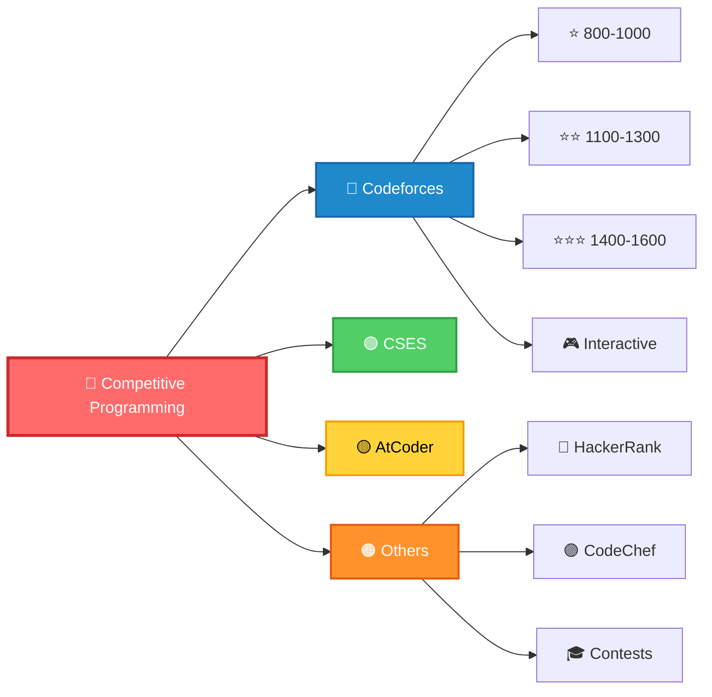

<div align="center">


<p align="center">
  <a href="https://codeforces.com/profile/tanvir_islam">
    
  </a>
  <a href="https://codeforces.com/profile/tanvir_islam">
    
  </a>
</p>

<p align="center">
  
  <a href="https://github.com/Tanvir-136">
    
  </a>
</p>

</div>

---

## 📊 Live Performance Dashboard

<div align="center">

### 🔵 Codeforces Statistics

<a href="https://codeforces.com/profile/tanvir_islam">
  
</a>

<br/><br/>


### 📈 Rating Progress

<a href="https://codeforces.com/profile/tanvir_islam">
  
</a>

### 🎯 Problem Categories (Live Data)

<a href="https://codeforces.com/profile/tanvir_islam">
  
</a>

</div>

---

## 🏆 Platform Statistics

<div align="center">

<table>
  <tr>
    <td align="center" width="25%">
      <a href="https://codeforces.com/profile/tanvir_islam">
        
        <h3>🔵 Codeforces</h3>
      </a>
      
      <br/>
      
      <br/>
      
    </td>
    <td align="center" width="25%">
      <a href="https://github.com/Tanvir-136">
        
        <h3>💻 GitHub</h3>
      </a>
      
      <br/>
      
      <br/>
      
    </td>
    <td align="center" width="25%">
      <a href="https://atcoder.jp/users/tanvir_islam">
        
        <h3>🟡 AtCoder</h3>
      </a>
      
    </td>
    <td align="center" width="25%">
      <a href="https://www.codechef.com/users/tanvir_islam">
        
        <h3>🟠 CodeChef</h3>
      </a>
      
    </td>
  </tr>
</table>

</div>

---

## 📁 Repository Structure

<div align="center">



</div>

<details open>
<summary><b>📂 Codeforces Solutions - Organized by Difficulty</b></summary>
<br>

```
Codeforces/
├── 📁 Ratting-800/      ⭐ Foundation Building
├── 📁 Ratting-900/      ⭐ Pattern Recognition
├── 📁 Ratting-1000/     ⭐⭐ Logic Development
├── 📁 Ratting-1100/     ⭐⭐ Problem Solving
├── 📁 Ratting-1200/     ⭐⭐⭐ Algorithmic Thinking
├── 📁 Ratting-1300/     ⭐⭐⭐ Advanced Concepts
├── 📁 Ratting-1400/     ⭐⭐⭐⭐ Expert Level
├── 📁 Ratting-1500/     ⭐⭐⭐⭐ Complex Problems
├── 📁 Ratting-1600/     ⭐⭐⭐⭐⭐ Master Tier
└── 📁 Interactive/      🎮 Interactive Problems
```

</details>

<details>
<summary><b>📂 CSES Problem Set</b></summary>
<br>

```
CSES/
└── 📄 Solutions organized by category
```

</details>

<details>
<summary><b>📂 AtCoder Solutions</b></summary>
<br>

```
AtCoder/
├── 📄 A_*.cpp    (Beginner friendly)
├── 📄 B_*.cpp    (Intermediate)
├── 📄 C_*.cpp    (Advanced)
└── 📄 D_*.cpp    (Expert)
```

</details>

---

## 💻 Competitive Programming Template

<details>
<summary><b>⚡ Click to view production-ready template</b></summary>

```cpp
#include <bits/stdc++.h>
using namespace std;

// ==================== FAST I/O ====================
#define FAST_IO ios_base::sync_with_stdio(0);cin.tie(0);cout.tie(0)
#define nl '\n'

// ==================== TYPE DEFINITIONS ====================
#define ll long long
#define ull unsigned long long
#define ld long double
#define vi vector<int>
#define vll vector<ll>
#define pii pair<int,int>
#define pll pair<ll,ll>

// ==================== CONTAINER OPERATIONS ====================
#define all(x) (x).begin(), (x).end()
#define rall(x) (x).rbegin(), (x).rend()
#define pb push_back
#define mp make_pair
#define fi first
#define se second

// ==================== CONSTANTS ====================
const int MOD = 1e9 + 7;
const int INF = 1e9;
const ll LINF = 1e18;
const double EPS = 1e-9;

// ==================== UTILITIES ====================
#define rep(i, a, b) for(int i = (a); i < (b); i++)
#define per(i, a, b) for(int i = (a); i >= (b); i--)

// ==================== MATH UTILITIES ====================
ll gcd(ll a, ll b) { return b ? gcd(b, a % b) : a; }
ll lcm(ll a, ll b) { return a / gcd(a, b) * b; }
ll power(ll a, ll b, ll mod = MOD) {
    ll res = 1;
    while(b > 0) {
        if(b & 1) res = (res * a) % mod;
        a = (a * a) % mod;
        b >>= 1;
    }
    return res;
}

// ==================== SOLUTION ====================
void solve() {
    // Implementation
}

// ==================== MAIN ====================
int main() {
    FAST_IO;
    int t = 1;
    cin >> t;
    while(t--) {
        solve();
    }
    return 0;
}
```

</details>

---

## 📚 Resources

<div align="center">

### 📖 Learning & References

[](https://cp-algorithms.com/)
[](https://cses.fi/problemset/)
[](https://codeforces.com/)

### 🔧 Tools

| Tool | Purpose | Link |
|:-----|:--------|:----:|
| VisuAlgo | Algorithm Visualization | [](https://visualgo.net/) |
| CF Analytics | Performance Analysis | [](https://cfviz.netlify.app/) |
| CP Editor | Coding Environment | [](https://cpeditor.org/) |

</div>

---

## 📈 GitHub Analytics

<div align="center">

<a href="https://github.com/Tanvir-136">
  
</a>
<a href="https://github.com/Tanvir-136">
  
</a>

<a href="https://github.com/Tanvir-136">
  
</a>
<a href="https://github.com/Tanvir-136">
  
</a>

</div>

---

## 🌐 Connect

<div align="center">

[](https://codeforces.com/profile/tanvir_islam)
[](https://atcoder.jp/users/tanvir_islam)
[](https://www.codechef.com/users/tanvir_islam)
[](https://github.com/Tanvir-136)
[](https://www.linkedin.com/in/tanvir-islam-35aa671b2)

<br/><br/>


**💡 "The only way to learn a new programming language is by writing programs in it." - Dennis Ritchie**

<sub>🔄 Live stats update automatically via APIs</sub>

</div>