```markdown
<div align="center">


<p align="center">
  <a href="https://github.com/Tanvir-136">
    
  </a>
  <a href="https://github.com/Tanvir-136">
    
  </a>
</p>

</div>

---

## 📊 Live Battle Station

<div align="center">

<a href="https://codeforces.com/profile/tanvir_islam">
    
</a>
<a href="https://codeforces.com/profile/tanvir_islam">
    
</a>
<a href="https://codeforces.com/profile/tanvir_islam">
    
</a>

<br/>

<a href="https://atcoder.jp/users/tanvir_islam">
    
</a>
<a href="https://www.codechef.com/users/tanvir_islam">
    
</a>

<br/>


</div>

### 📈 Visual Analytics
<div align="center">
  <a href="https://codeforces.com/profile/tanvir_islam">
    
  </a>
</div>

---

## 🗺️ Repository Map

```mermaid
graph TD
    CP[🚀 Competitive Programming]
    CP --> CF[🔵 Codeforces]
    CP --> AT[🟡 AtCoder]
    CP --> CS[🟢 CSES]
    
    CF --> R8[Rating 800-1200]
    CF --> R12[Rating 1300+]
    
    style CP fill:#24292e,stroke:#58a6ff,stroke-width:2px,color:#fff
    style CF fill:#1f8acb,stroke:#fff,stroke-width:1px,color:#fff
    style AT fill:#000,stroke:#fea303,stroke-width:1px,color:#fff
    style CS fill:#2f9e44,stroke:#fff,stroke-width:1px,color:#fff

```

<div align="center">



</div>

| Platform | Difficulty/Tag | Access |
| --- | --- | --- |
| **Codeforces** | `800` `900` `1000` `1100` `1200` | [📂 Browse](https://www.google.com/search?q=https://github.com/Tanvir-136/Competitive-Programming/tree/main/Codeforces) |
| **AtCoder** | `Beginner` `Regular` `Grand` | [📂 Browse](https://www.google.com/search?q=https://github.com/Tanvir-136/Competitive-Programming/tree/main/AtCoder) |
| **CSES** | `DP` `Graph` `Introductory` | [📂 Browse](https://www.google.com/search?q=https://github.com/Tanvir-136/Competitive-Programming/tree/main/CSES) |
| **Templates** | `Graph` `Math` `String` `Data Structures` | [📂 Browse](https://www.google.com/search?q=https://github.com/Tanvir-136/Competitive-Programming/tree/main/Templates) |

---

## ⚡ Quick-Start Template

<details>
<summary><b>Click to view my <tt>CP_Template.cpp</tt></b></summary>

```cpp
#include <bits/stdc++.h>
using namespace std;

// Speed
#define FAST_IO ios_base::sync_with_stdio(0);cin.tie(0);cout.tie(0)

// Types
#define ll long long
#define pii pair<int,int>
#define vi vector<int>

// Constants
const int MOD = 1e9 + 7;
const ll INF = 1e18;

void solve() {
    // Your genius code goes here
}

int main() {
    FAST_IO;
    int t = 1;
    cin >> t;
    while(t--) solve();
    return 0;
}

```

</details>

---

## 🐙 GitHub Activity

<div align="center">


</div>

<div align="center">

</div>

```

```