<div align="center">


<p align="center">
  <a href="https://codeforces.com/profile/tanvir_islam">
    
  </a>
  <a href="https://codeforces.com/profile/tanvir_islam">
    
  </a>
</p>

<p align="center">
  <a href="https://github.com/Tanvir-136">
    
  </a>
  <a href="https://github.com/Tanvir-136?tab=followers">
    
  </a>
</p>

</div>

---

## 📊 Live Performance Dashboard

<div align="center">

<table>
  <tr>
    <td align="center" width="33%">
      <a href="https://codeforces.com/profile/tanvir_islam">
        
      </a>
      <br/>
      <a href="https://codeforces.com/profile/tanvir_islam">
        
      </a>
      <a href="https://codeforces.com/profile/tanvir_islam">
        
      </a>
      <a href="https://codeforces.com/profile/tanvir_islam">
        
      </a>
      <br/>
      <a href="https://codeforces.com/profile/tanvir_islam">
        
      </a>
    </td>
    <td align="center" width="33%">
      <a href="https://atcoder.jp/users/tanvir_islam">
        
      </a>
      <br/>
      <a href="https://atcoder.jp/users/tanvir_islam">
        
      </a>
    </td>
    <td align="center" width="33%">
      <a href="https://github.com/Tanvir-136">
        
      </a>
      <br/>
      <a href="https://github.com/Tanvir-136">
        
      </a>
      <a href="https://github.com/Tanvir-136?tab=followers">
        
      </a>
    </td>
  </tr>
</table>

</div>

---

## 📁 Repository Structure

```mermaid
graph LR
    A[💼 Competitive Programming] --> B[🔵 Codeforces]
    A --> C[🟢 CSES]
    A --> D[🟡 AtCoder]
    A --> E[🟠 Others]
    
    B --> B1[⭐ 800-1000]
    B --> B2[⭐⭐ 1100-1300]
    B --> B3[⭐⭐⭐ 1400-1600]
    B --> B4[🎮 Interactive]
    
    E --> E1[🔶 HackerRank]
    E --> E2[🟣 CodeChef]
    E --> E3[🎓 Contests]
    
    style A fill:#ff6b6b,stroke:#c92a2a,stroke-width:3px,color:#fff
    style B fill:#1f8acb,stroke:#1864ab,stroke-width:2px,color:#fff
    style C fill:#51cf66,stroke:#2f9e44,stroke-width:2px,color:#fff
    style D fill:#ffd43b,stroke:#f59f00,stroke-width:2px,color:#000
    style E fill:#ff922b,stroke:#e8590c,stroke-width:2px,color:#fff
```

<div align="center">



</div>

<details open>
<summary><b>📂 Codeforces Solutions — Clickable</b></summary>

- [Ratting-800/](https://github.com/Tanvir-136/Competitive-Programming/tree/main/Codeforces/Ratting-800/)
- [Ratting-900/](https://github.com/Tanvir-136/Competitive-Programming/tree/main/Codeforces/Ratting-900/)
- [Ratting-1000/](https://github.com/Tanvir-136/Competitive-Programming/tree/main/Codeforces/Ratting-1000/)
- [Ratting-1100/](https://github.com/Tanvir-136/Competitive-Programming/tree/main/Codeforces/Ratting-1100/)
- [Ratting-1200/](https://github.com/Tanvir-136/Competitive-Programming/tree/main/Codeforces/Ratting-1200/)
- [Ratting-1300/](https://github.com/Tanvir-136/Competitive-Programming/tree/main/Codeforces/Ratting-1300/)
- [Ratting-1400/](https://github.com/Tanvir-136/Competitive-Programming/tree/main/Codeforces/Ratting-1400/)
- [Ratting-1500/](https://github.com/Tanvir-136/Competitive-Programming/tree/main/Codeforces/Ratting-1500/)
- [Ratting-1600/](https://github.com/Tanvir-136/Competitive-Programming/tree/main/Codeforces/Ratting-1600/)
- [Interactive/](https://github.com/Tanvir-136/Competitive-Programming/tree/main/Codeforces/Interactive/)
</details>

<details>
<summary><b>📂 CSES Problem Set</b></summary>

- [CSES/](https://github.com/Tanvir-136/Competitive-Programming/tree/main/CSES/)
</details>

<details>
<summary><b>📂 AtCoder Solutions</b></summary>

- [AtCoder/](https://github.com/Tanvir-136/Competitive-Programming/tree/main/AtCoder/)
</details>

---

## 💻 Competitive Programming Template

<details>
<summary><b>⚡ Click to view template</b></summary>

```cpp
// ...existing code...
#include <bits/stdc++.h>
using namespace std;

// ==================== FAST I/O ====================
#define FAST_IO ios_base::sync_with_stdio(0);cin.tie(0);cout.tie(0)
#define nl '\n'

// ==================== TYPE DEFINITIONS ====================
#define ll long long
#define ull unsigned long long
#define ld long double
#define vi vector<int>
#define vll vector<ll>
#define pii pair<int,int>
#define pll pair<ll,ll>

// ==================== CONTAINER OPERATIONS ====================
#define all(x) (x).begin(), (x).end()
#define rall(x) (x).rbegin(), (x).rend()
#define pb push_back
#define mp make_pair
#define fi first
#define se second

// ==================== CONSTANTS ====================
const int MOD = 1e9 + 7;
const int INF = 1e9;
const ll LINF = 1e18;
const double EPS = 1e-9;

// ==================== UTILITIES ====================
#define rep(i, a, b) for(int i = (a); i < (b); i++)
#define per(i, a, b) for(int i = (a); i >= (b); i--)

// ==================== MATH UTILITIES ====================
ll gcd(ll a, ll b) { return b ? gcd(b, a % b) : a; }
ll lcm(ll a, ll b) { return a / gcd(a, b) * b; }
ll power(ll a, ll b, ll mod = MOD) {
    ll res = 1;
    while(b > 0) {
        if(b & 1) res = (res * a) % mod;
        a = (a * a) % mod;
        b >>= 1;
    }
    return res;
}

// ==================== SOLUTION ====================
void solve() {
    // Implementation
}

// ==================== MAIN ====================
int main() {
    FAST_IO;
    int t = 1;
    cin >> t;
    while(t--) {
        solve();
    }
    return 0;
}
// ...existing code...
```

</details>

---

## 🌐 Connect

<div align="center">

[](https://codeforces.com/profile/tanvir_islam)
[](https://atcoder.jp/users/tanvir_islam)
[](https://github.com/Tanvir-136)
[](https://www.linkedin.com/in/tanvir-islam-35aa671b2)

<br/><br/>


</div>