<div align="center">


<p align="center">
  <a href="https://codeforces.com/profile/tanvir_islam">
    
  </a>
  <a href="https://github.com/Tanvir-136">
    
  </a>
  <a href="https://www.linkedin.com/in/tanvir-islam-35aa671b2">
    
  </a>
</p>

<p align="center">
  
  
</p>

</div>

---

## 📊 Live Coding Stats

<div align="center">

### 🔵 Codeforces Real-Time Stats
<a href="https://codeforces.com/profile/tanvir_islam">
  
</a>

### 🎯 Problem Solving Activity
<a href="https://codeforces.com/profile/tanvir_islam">
  
</a>

### 📈 Rating Graph
<a href="https://codeforces.com/profile/tanvir_islam">
  
</a>

</div>

---

## 🏆 Platform Statistics

<div align="center">

<table>
  <tr>
    <td align="center" width="33%">
      
      <h3>🔵 Codeforces</h3>
      <a href="https://codeforces.com/profile/tanvir_islam">
        
      </a>
      <br/>
      
      <br/>
      
    </td>
    <td align="center" width="33%">
      
      <h3>🟡 AtCoder</h3>
      <a href="https://atcoder.jp/users/tanvir_islam">
        
      </a>
      <br/>
      
      <br/>
      
    </td>
    <td align="center" width="33%">
      
      <h3>🟢 CSES</h3>
      <a href="https://cses.fi/user/123">
        
      </a>
      <br/>
      
      <br/>
      
    </td>
  </tr>
</table>

</div>

---

## 📁 Repository Structure

```mermaid
graph TB
    A[🏠 Competitive Programming] --> B[🔵 Codeforces]
    A --> C[🟢 CSES]
    A --> D[🟡 AtCoder]
    A --> E[🟠 Others]
    
    B --> B1[⭐ Rating 800]
    B --> B2[⭐ Rating 900]
    B --> B3[⭐⭐ Rating 1000]
    B --> B4[⭐⭐ Rating 1100]
    B --> B5[⭐⭐⭐ Rating 1200]
    B --> B6[⭐⭐⭐ Rating 1300]
    B --> B7[⭐⭐⭐⭐ Rating 1400]
    B --> B8[⭐⭐⭐⭐ Rating 1500]
    B --> B9[⭐⭐⭐⭐⭐ Rating 1600]
    B --> B10[🎮 Interactive]
    
    E --> E1[🔶 HackerRank]
    E --> E2[🟣 CodeChef]
    E --> E3[🎓 IUT Contests]
    
    style A fill:#ff6b6b,stroke:#c92a2a,stroke-width:3px,color:#fff
    style B fill:#1f8acb,stroke:#1864ab,stroke-width:2px,color:#fff
    style C fill:#51cf66,stroke:#2f9e44,stroke-width:2px,color:#fff
    style D fill:#ffd43b,stroke:#f59f00,stroke-width:2px,color:#000
    style E fill:#ff922b,stroke:#e8590c,stroke-width:2px,color:#fff
```

<div align="center">



</div>

<details open>
<summary><b>🔵 Codeforces Solutions</b></summary>
<br>

<div align="center">

| Difficulty | Problems Count | Status | Progress |
|:----------:|:--------------:|:------:|:--------:|
|  | 50+ | ✅ |  |
|  | 60+ | ✅ |  |
|  | 70+ | ✅ |  |
|  | 65+ | ✅ |  |
|  | 80+ | 🔄 |  |
|  | 60+ | 🔄 |  |
|  | 45+ | 🔄 |  |
|  | 30+ | 🔄 |  |
|  | 20+ | 🔄 |  |
|  | 20+ | 🔄 |  |

</div>

</details>

<details>
<summary><b>🟢 CSES Problem Set</b></summary>
<br>

<div align="center">

| Category | Count | Completion |
|:---------|:-----:|:----------:|
| Introductory Problems | 19/19 |  |
| Sorting and Searching | 15/35 |  |
| Dynamic Programming | 10/19 |  |
| Graph Algorithms | 8/36 |  |
| Range Queries | 5/19 |  |
| Tree Algorithms | 3/16 |  |

</div>

</details>

<details>
<summary><b>🟡 AtCoder Solutions</b></summary>
<br>

<div align="center">

| Problem Tier | Solved | Total |
|:------------:|:------:|:-----:|
| 📗 A Problems | 100+ | - |
| 📘 B Problems | 80+ | - |
| 📙 C Problems | 50+ | - |
| 📕 D Problems | 20+ | - |

</div>

</details>

---

## 🎯 Algorithm Mastery Progress

<div align="center">


<table>
<tr>
<td width="50%">

### 📊 Data Structures
```
Arrays & Strings       ████████████ 95%
Stack & Queue          ███████████░ 90%
Linked Lists           ██████████░░ 85%
Trees                  █████████░░░ 75%
Heaps                  ████████░░░░ 70%
Hash Tables            ███████████░ 90%
Segment Trees          ██████░░░░░░ 50%
Fenwick Trees          █████░░░░░░░ 45%
```

</td>
<td width="50%">

### 🧮 Algorithms
```
Sorting & Searching    ████████████ 95%
Greedy                 ███████████░ 88%
Two Pointers           ██████████░░ 82%
Sliding Window         █████████░░░ 76%
Dynamic Programming    ████████░░░░ 65%
Graph Algorithms       ███████░░░░░ 60%
Number Theory          ██████░░░░░░ 55%
String Algorithms      █████░░░░░░░ 48%
```

</td>
</tr>
</table>

</div>

---

## 💻 Competitive Programming Template

<details>
<summary><b>⚡ Click to view my CP template</b></summary>

```cpp
// 🚀 Optimized Competitive Programming Template
// Author: Tanvir Islam
// Last Updated: 2024

#include <bits/stdc++.h>
using namespace std;

// ==================== MACROS ====================
#define FAST_IO ios_base::sync_with_stdio(0);cin.tie(0);cout.tie(0)
#define endl '\n'
#define ll long long
#define ull unsigned long long
#define ld long double
#define vi vector<int>
#define vll vector<ll>
#define pii pair<int,int>
#define pll pair<ll,ll>
#define all(x) (x).begin(), (x).end()
#define rall(x) (x).rbegin(), (x).rend()
#define pb push_back
#define mp make_pair
#define fi first
#define se second

// ==================== CONSTANTS ====================
const int MOD = 1e9 + 7;
const int INF = 1e9;
const ll LINF = 1e18;
const double PI = acos(-1.0);
const double EPS = 1e-9;

// ==================== UTILITIES ====================
#define dbg(x) cout << #x << " = " << x << endl
#define yes cout << "YES" << endl
#define no cout << "NO" << endl
#define rep(i, a, b) for(int i = (a); i < (b); i++)
#define per(i, a, b) for(int i = (a); i >= (b); i--)
#define trav(a, x) for(auto& a : x)

// ==================== MATH UTILITIES ====================
ll gcd(ll a, ll b) { return b ? gcd(b, a % b) : a; }
ll lcm(ll a, ll b) { return a / gcd(a, b) * b; }
ll power(ll a, ll b, ll mod = MOD) {
    ll res = 1;
    while(b > 0) {
        if(b & 1) res = (res * a) % mod;
        a = (a * a) % mod;
        b >>= 1;
    }
    return res;
}

// ==================== TEMPLATE FUNCTIONS ====================
template<typename T>
void print(vector<T>& v) {
    for(auto& x : v) cout << x << " ";
    cout << endl;
}

template<typename T>
void read(vector<T>& v) {
    for(auto& x : v) cin >> x;
}

// ==================== SOLUTION ====================
void solve() {
    // Your solution here
    
}

// ==================== MAIN ====================
int main() {
    FAST_IO;
    
    int t = 1;
    cin >> t;
    
    while(t--) {
        solve();
    }
    
    return 0;
}
```

</details>

---

## 📚 Learning Resources & Tools

<div align="center">

<table>
<tr>
<td width="33%" align="center">

### 📖 Theory & Books
[](https://cp-algorithms.com/)
[](https://cses.fi/book/book.pdf)
[](https://mitpress.mit.edu/books/introduction-algorithms)

</td>
<td width="33%" align="center">

### 🎥 Video Tutorials
[](https://www.youtube.com/c/Errichto)
[](https://www.youtube.com/c/WilliamFiset-videos)
[](https://www.youtube.com/c/tmwilliamlin168)

</td>
<td width="33%" align="center">

### 🔧 Practice Platforms
[](https://codeforces.com/)
[](https://leetcode.com/)
[](https://atcoder.jp/)

</td>
</tr>
</table>

</div>

### 🧰 Essential Tools

<div align="center">

| Tool | Purpose | Link |
|:-----|:--------|:----:|
| 🨠VisuAlgo | Algorithm Visualization | [](https://visualgo.net/) |
| 🔠CP Editor | Competitive Programming IDE | [](https://cpeditor.org/) |
| 📊 CF Analytics | Codeforces Analytics | [](https://cfviz.netlify.app/) |
| 🧮 OEIS | Integer Sequences | [](https://oeis.org/) |
| 📠Ideone | Online Compiler | [](https://ideone.com/) |

</div>

---

## 🏆 Achievements & Milestones

<div align="center">

<table>
<tr>
<td width="50%">

### ✅ Completed
```
✓ 500+ Problems on Codeforces
✓ 50+ CSES Problems Solved
✓ 100+ Contests Participated
✓ 100+ AtCoder Problems
✓ Daily Solving Streak (30+ days)
✓ Contributed to CP Community
```

</td>
<td width="50%">

### 🎯 Current Goals
```
→ Reach Expert on Codeforces
→ Solve 1000+ Total Problems
→ Complete CSES Problem Set
→ Master Dynamic Programming
→ Learn Advanced Graph Theory
→ Participate in top 100
```

</td>
</tr>
</table>

</div>

---

## 📈 GitHub Activity

<div align="center">

<a href="https://github.com/Tanvir-136">
  
</a>
<a href="https://github.com/Tanvir-136">
  
</a>

<a href="https://github.com/Tanvir-136">
  
</a>
<a href="https://github.com/Tanvir-136">
  
</a>

</div>

---

## 🤝 Contributing

<div align="center">

I welcome contributions! Here's how you can help:

[](https://github.com/Tanvir-136/Competitive-Programming/issues)
[](https://github.com/Tanvir-136/Competitive-Programming/pulls)
[](https://github.com/Tanvir-136/Competitive-Programming/network/members)

</div>

```
📝 Report bugs or issues
💡 Suggest new features or improvements
🔀 Submit pull requests
⭐ Star this repository
🍴 Fork and create your own solutions
```

---

## 💖 Support & Connect

<div align="center">

<h3>If you find this repository helpful, please consider:</h3>

<a href="https://github.com/Tanvir-136/Competitive-Programming">
  
</a>
<a href="https://github.com/Tanvir-136">
  
</a>
<a href="https://www.linkedin.com/in/tanvir-islam-35aa671b2">
  
</a>

<br><br>

### 🌐 Find me on:

[](https://codeforces.com/profile/tanvir_islam)
[](https://atcoder.jp/users/tanvir_islam)
[](https://github.com/Tanvir-136)
[](https://www.linkedin.com/in/tanvir-islam-35aa671b2)
[](mailto:your.email@gmail.com)

</div>

---

<div align="center">

### 💭 Quote of the Day


<br><br>

### 🎮 When I'm not coding...


<br><br>

### 🏅 GitHub Trophies


<br><br>


**✨ Happy Coding! Keep Solving, Keep Learning! ✨**

<sub>🔄 Last Updated: February 2024 | 🤖 Auto-updated with GitHub Actions</sub>

</div>